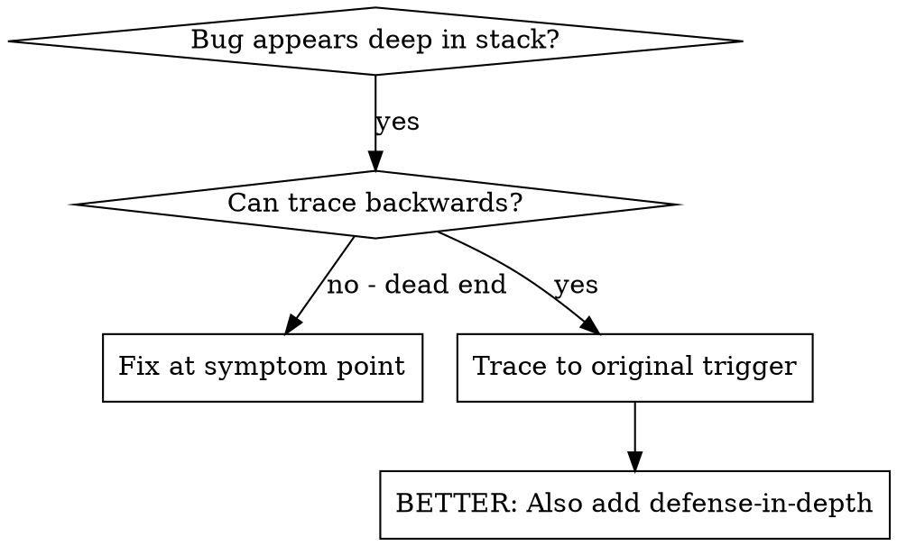
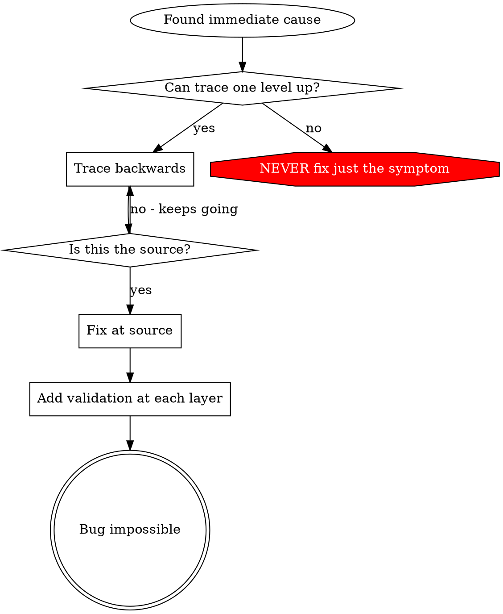

# Root cause tracing

## Contents

- [When to use](#when-to-use)
- [The tracing process](#the-tracing-process)
- [Adding stack traces](#adding-stack-traces)
- [Finding which test causes pollution](#finding-which-test-causes-pollution)
- [Worked example: empty projectDir](#worked-example-empty-projectdir)
- [Key principle](#key-principle)
- [Stack trace tips](#stack-trace-tips)

## Overview

Bugs often manifest deep in the call stack — a repo initialised in the wrong directory, a file
created in the wrong place, a database opened with the wrong path. The instinct is to fix where the
error appears, but that treats a symptom.

**Core principle:** Trace backward through the call chain until you find the original trigger, then
fix at the source.

## When to use



Use when:
- The error happens deep in execution, not at the entry point
- The stack trace shows a long call chain
- It is unclear where the invalid data originated
- You need to find which test or code path triggers the problem

## The tracing process

**1. Observe the symptom.**

```
Error: git init failed in ~/project/packages/core
```

**2. Find the immediate cause.** What code directly causes this?

```typescript
await execFileAsync('git', ['init'], { cwd: projectDir });
```

**3. Ask: what called this?**

```
WorktreeManager.createSessionWorktree(projectDir, sessionId)
  → called by Session.initializeWorkspace()
  → called by Session.create()
  → called by test at Project.create()
```

**4. Keep tracing up.** What value was passed?

- `projectDir = ''` (empty string)
- An empty string as `cwd` resolves to `process.cwd()`
- That is the source code directory

**5. Find the original trigger.** Where did the empty string come from?

```typescript
const context = setupCoreTest();       // Returns { tempDir: '' }
Project.create('name', context.tempDir); // Accessed before beforeEach
```

## Adding stack traces

When you cannot trace by hand, add instrumentation:

```typescript
async function gitInit(directory: string) {
  const stack = new Error().stack;
  console.error('DEBUG git init:', {
    directory,
    cwd: process.cwd(),
    nodeEnv: process.env.NODE_ENV,
    stack,
  });

  await execFileAsync('git', ['init'], { cwd: directory });
}
```

**Critical:** in tests use `console.error()`, not a logger — the logger may be suppressed.

Run and capture:

```bash
npm test 2>&1 | grep 'DEBUG git init'
```

Analyze the stack traces: look for test file names, find the line that triggered the call, and
identify the pattern (same test? same parameter?).

## Finding which test causes pollution

If something appears during tests but you don't know which test creates it, use the bisection
script `$SKILL_DIR/scripts/find-polluter.sh`:

```bash
$SKILL_DIR/scripts/find-polluter.sh '.git' 'src/**/*.test.ts'
```

It runs the tests one by one and stops at the first polluter.

## Worked example: empty projectDir

**Symptom:** `.git` created in `packages/core/` (the source tree).

**Trace chain:**

1. `git init` runs in `process.cwd()` ← empty `cwd` parameter
2. WorktreeManager called with an empty projectDir
3. `Session.create()` passed an empty string
4. The test accessed `context.tempDir` before `beforeEach`
5. `setupCoreTest()` returns `{ tempDir: '' }` initially

**Root cause:** top-level variable initialised with the empty value.

**Fix:** made `tempDir` a getter that throws if accessed before `beforeEach`.

**Defense-in-depth added:** entry validation in `Project.create()`, a non-empty check in the
workspace manager, a guard refusing the operation outside a temp directory in tests, and stack-trace
logging before the operation.

## Key principle



**NEVER fix only where the error appears.** Trace back to find the original trigger. Then add
validation at each layer, so the bug becomes impossible rather than merely absent.

## Stack trace tips

- **In tests:** use `console.error()` — a logger may be suppressed
- **Before the operation:** log before the dangerous operation, not after it fails
- **Include context:** directory, cwd, environment variables, timestamps
- **Capture the stack:** `new Error().stack` shows the complete call chain
