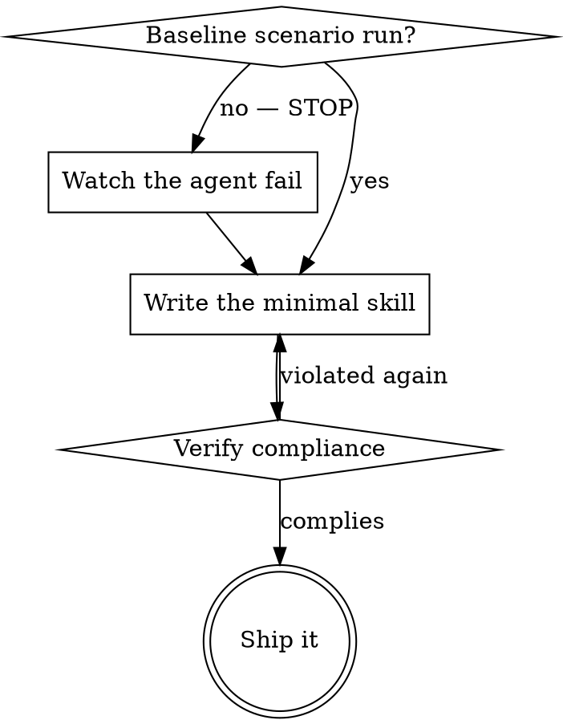

# Write skill

A **skill** is a reference guide for a proven technique, pattern, or tool, kept where agents look
for one and loaded when a described situation arises. It is not a narrative about how a problem was
solved once.

**Writing a skill is the RED-GREEN-REFACTOR cycle applied to process documentation.** Write the test
case (a pressure scenario), watch it fail (the agent's baseline behaviour), write the skill, watch
the test pass (the agent complies), then refactor (close the loopholes).

**Core principle:** if you did not watch an agent fail without the skill, you do not know the skill
teaches the right thing.

`$SKILL_DIR` in the paths below is **notation, not an exported variable** — it stands for this
skill's own directory, the one holding this `SKILL.md`. Skills live in the runtime's skills
directory; the cross-agent store at `~/.agents/skills/` is the usual one.

<HARD-GATE>
NO SKILL WITHOUT A FAILING TEST FIRST. This applies to NEW skills and to EDITS of existing ones.
Wrote the skill before testing it? Delete it and start over. Edited without testing? Same violation.

**No exceptions:**
- Not for "simple additions"
- Not for "just adding a section"
- Not for "documentation updates"
- Don't keep the untested change as "reference"
- Don't "adapt" it while testing
- Delete means delete
</HARD-GATE>

## TDD mapping for skills

| TDD concept | Skill creation |
|-------------|----------------|
| **Test case** | Pressure scenario run against an agent |
| **Production code** | Skill document (`SKILL.md`) |
| **Test fails (RED)** | Agent violates the rule without the skill (baseline) |
| **Test passes (GREEN)** | Agent complies with the skill present |
| **Refactor** | Close loopholes while keeping compliance |
| **Write test first** | Run the baseline scenario BEFORE writing the skill |
| **Watch it fail** | Document the exact rationalizations the agent uses |
| **Minimal code** | Write guidance addressing those specific violations |
| **Watch it pass** | Verify the agent now complies |
| **Refactor cycle** | Find new rationalizations → plug → re-verify |

The whole creation process follows RED-GREEN-REFACTOR. The skill-specific test formats — pressure
scenarios, pressure types, rationalization tables — are in
[references/testing-skills-with-subagents.md](references/testing-skills-with-subagents.md).

## When to create a skill

**Create when:**

- The technique was not intuitively obvious to you
- You would reference it again across projects
- The pattern applies broadly, not just to this project
- Others would benefit from it

**Don't create for:**

- One-off solutions
- Standard practices already well documented elsewhere
- Project-specific conventions — those belong in the repo's instruction file (`AGENTS.md`, and counterparts such as `CLAUDE.md` or `.cursor/rules`)
- Mechanical constraints: if a regex or a validator can enforce it, automate it and save
  documentation for the judgment calls

## Skill types

- **Technique** — a concrete method with steps to follow.
- **Pattern** — a way of thinking about a problem.
- **Reference** — API docs, syntax guides, tool documentation.

The type decides how to test it: discipline rules need pressure scenarios, techniques need
application scenarios, references need retrieval scenarios. Table in
[references/testing-skills-with-subagents.md](references/testing-skills-with-subagents.md).

## Directory layout

```
<category>/
  <skill-name>/
    SKILL.md              # Required. The only file loaded at startup is its frontmatter.
    references/           # Detail too large for the body, read on demand
    scripts/              # Executable tools the skill runs
    assets/               # Templates and static resources
```

Installed skills are flat: the category organises the repository only, and the name is the
directory. **Separate a file out when** it is heavy reference (100+ lines) or a reusable tool;
**keep it inline** for principles, concepts, and code patterns under ~50 lines.

## SKILL.md structure

**Frontmatter (YAML)** — `name` and `description` are required; `license`, `compatibility`,
`metadata` and `allowed-tools` are the rest of the standard field set, and nothing outside it should
appear without a reason an agent elsewhere can ignore.

- `name`: lowercase alphanumeric with single internal hyphens, matching the directory. The reserved
  words of any one vendor are best avoided — a catalog installs names flat, so a collision silently
  overwrites.
- `description`: third person, and it must carry **both what the skill does and when to reach for
  it** — it is the only text loaded at startup, and the only thing an agent uses to decide whether
  the skill applies. Up to 1024 characters.

Beyond the spec, this catalog adds three limits: the **body stays under 500 lines** (past that,
detail moves into `references/`); **reference chains stay one level deep**, so every
`references/*.md` is linked from `SKILL.md` itself; and a **reference over 100 lines with two or more
sections opens with a `## Contents` list**, so a partial read still shows the full scope.

**Body skeleton:**

```markdown
# Skill name

## Overview
What is this, and what is the core principle? One or two sentences.

## When to use
Symptoms and situations that call for it, and when NOT to.

## Core pattern (techniques and patterns)
Before/after comparison.

## Quick reference
A table or bullets for scanning the common operations.

## Implementation
Inline code for simple patterns, a link for heavy reference or a reusable tool.

## Common mistakes
What goes wrong, and the fix.

## Real-world impact (optional)
Concrete results.
```

## Write the description for discovery

An agent reads the description to answer "should I read this skill right now?" Optimise for that,
because the description is the whole of the startup cost and the whole of the discovery signal.

**Describe the triggering conditions, and do not summarize the workflow.** A description that
summarizes the process becomes a shortcut: an agent may follow the description and skip the body.
Testing showed this directly — a description saying "code review between tasks" led an agent to do
one review when the body's flowchart showed two, and changing the description to name only the
triggering condition made the agent read the flowchart and follow both stages. The trap is that the
summary reads better and quietly replaces the skill.

```yaml
# BAD: summarizes the workflow — the agent may follow this instead of the body
description: Use when executing plans - one agent per task with a review between tasks

# BAD: too much process detail
description: Use for test-first work - write a test, watch it fail, write minimal code, refactor

# GOOD: triggering conditions only
description: Use when executing an implementation plan whose tasks are independent
```

**Content:**

- Concrete triggers, symptoms and situations that signal the skill applies
- The *problem* (race conditions, inconsistent behaviour), not one language's symptom
  (`setTimeout`, a specific sleep call)
- Technology-agnostic triggers unless the skill itself is technology-specific — and then say so in
  the trigger
- Third person; the description is injected into a system prompt
- Keywords an agent would actually search for: error strings, symptoms, synonyms, command and
  library names
- Under 500 characters when it can be done without losing a trigger

## Naming

Name the skill for the action it takes or the insight it carries, in the active verb-first form the
catalog uses elsewhere — `write-plan`, `brainstorm-design`, `debug-systematically`, not
`plan-writing`, `skill-creation` or `data-structure-refactoring`. An agent searching for a technique
finds the thing it wants to do, not the category it falls in.

## Token efficiency

Frequently loaded skills cost every conversation. Aim for under 150 words for a getting-started
workflow, under 200 for the ones loaded most often, and under 500 elsewhere.

- Move flag lists and option tables into the tool's own `--help`, and point at it
- Compress examples to the words that carry the pattern
- Delete anything a linked reference already says
- Don't explain what the command itself makes obvious
- Don't give three examples of one pattern

```bash
wc -w $SKILL_DIR/SKILL.md
```

## Flowcharts

Use a flowchart ONLY for:

- A non-obvious decision point
- A process loop where you might stop too early
- A "when to use A vs B" choice

Never for reference material (tables, lists), code examples (code blocks), linear instructions
(numbered lists), or labels with no semantic meaning.



Style rules for the graphviz dialect live in
[references/graphviz-conventions.dot](references/graphviz-conventions.dot). To render a skill's
flowcharts to SVG for the user:

```bash
$SKILL_DIR/scripts/render-graphs.js <skill-directory>            # one SVG per diagram
$SKILL_DIR/scripts/render-graphs.js <skill-directory> --combine  # all diagrams in one SVG
```

The script needs `graphviz` (`dot`) on the system.

## Code examples

One excellent example beats many mediocre ones. Pick the language closest to the skill's subject,
and make the example complete, runnable, commented with *why*, taken from a real scenario, and ready
to adapt. Never implement the same example in five languages, never ship fill-in-the-blank
templates, never contrive a toy.

## Match the form to the failure

Classify the baseline failure before writing the guidance. The form that bulletproofs one failure
type measurably backfires on another.

| Baseline failure | Right form | Wrong form |
|---|---|---|
| Skips or violates a rule under pressure (knows better, does it anyway) | Prohibition + rationalization table + red flags | Soft guidance ("prefer…", "consider…") |
| Complies, but the output has the wrong shape (bloated prompt, buried verdict, restated spec) | Positive recipe: state what the output IS — its parts, in order | Prohibition list ("don't restate", "never narrate") |
| Omits a required element from something it already produces | Structural: a REQUIRED field or slot in the template it fills in | A prose reminder near the template |
| Behaviour should depend on a condition | A conditional keyed to an observable predicate ("if the brief exists, reference it") | An unconditional rule plus exemption clauses |

**Why prohibitions backfire on shaping problems:** under a competing incentive ("make the prompt
self-contained"), an agent negotiates with "don't X". In head-to-head wording tests on dispatch
guidance, the prohibition arm produced clearly more of the unwanted content than the recipe arm
(fully separated distributions), and trended worse than the no-guidance control. A recipe leaves
nothing to negotiate: the output matches the stated shape or it does not. Micro-test your own case
rather than assuming — but never reach for the prohibition by default.

**Whichever form you pick:**

- **No nuance clauses.** "Don't X unless it matters" reopens the negotiation; appending one nuance
  clause to a winning recipe degraded it from consistent to noisy in the same tests. Express a real
  exception as its own conditional on an observable predicate.
- **Exemption clauses don't scope.** "This limit doesn't apply to code blocks" still suppresses code
  blocks. If part of the output must be exempt, restructure so the rule cannot reach it.

## Bulletproofing against rationalization

An agent that knows a rule and skips it under pressure will find loopholes. This toolkit is for that
discipline failure — for wrong-shaped output or an omitted element, use the forms above instead.

- **Close every loophole explicitly.** Forbid the specific workaround, not just the act: "don't keep
  it as reference", "don't adapt it while writing the tests", "delete means delete".
- **Cut off "spirit vs letter".** State the foundational principle early — *violating the letter of
  the rules is violating the spirit of the rules* — and an entire class of rationalization closes.
- **Build the rationalization table from baseline testing.** Every excuse the agent actually made
  goes in, verbatim, with the reality beside it.
- **Keep a red-flags list** so the agent can catch itself mid-rationalization.
- **Put the symptom of the violation in the description**, so the skill loads when the agent is
  ABOUT to break the rule.

The psychology behind these — why imperative framing, forced choices and universal patterns raise
compliance, and where the ethics line sits — is in
[references/persuasion-principles.md](references/persuasion-principles.md).

## Testing

Different skill types need different tests:

| Type | Test with | Success |
|------|-----------|---------|
| Discipline-enforcing | Academic questions, pressure scenarios, several pressures combined | Agent follows the rule under maximum pressure |
| Technique | Application scenarios, variations, missing-information probes | Agent applies the technique to a new scenario |
| Pattern | Recognition scenarios, counter-examples | Agent knows when the mental model applies, and when it does not |
| Reference | Retrieval scenarios, gap probes | Agent finds and correctly applies the information |

**Common rationalizations for skipping this, and their reality:**

| Excuse | Reality |
|--------|---------|
| "The skill is obviously clear" | Clear to you ≠ clear to another agent. Test it. |
| "It's just a reference" | References have gaps and unclear sections. Test retrieval. |
| "Testing is overkill" | Untested skills have issues, always. Short testing saves hours. |
| "I'll test if problems emerge" | Problems means the agent cannot use the skill. Test before deploying. |
| "Too tedious" | Less tedious than debugging a bad skill in production. |
| "I'm confident it's good" | Overconfidence guarantees issues. Test anyway. |
| "Academic review is enough" | Reading ≠ using. Test application. |
| "No time" | Deploying untested costs more time fixing it later. |

All of these mean: test before deploying, no exceptions. Full methodology — pressure scenarios,
pressure types, plugging holes systematically, meta-testing —
in [references/testing-skills-with-subagents.md](references/testing-skills-with-subagents.md).

**Micro-test the wording before running full scenarios.** Full pressure runs are the final gate but
slow to iterate. First, one fresh context per call (a raw model call, or a single-shot sub-agent
where the agent has one), with the realistic context the guidance will live in as the system side
and a task that tempts the failure as the user side. Always include a no-guidance control — if the
control does not exhibit the failure, there is nothing to fix. Use 5+ repetitions per variant;
single samples lie. Read every flagged match by hand, because echoed templates and quoted
counter-examples masquerade as hits. Treat variance as a metric: when the wording binds, repetitions
converge on one shape, and five different interpretations mean it is not binding yet — tighten the
form before adding words.

**Testing how it is discovered** — the instruction-file wording that makes an agent consult a skills
store at all — is a separate campaign: [references/agents-md-testing.md](references/agents-md-testing.md).

## Anti-patterns

- **Narrative example.** "In a session we found an empty directory caused…" — too specific, not
  reusable.
- **Multi-language dilution.** One example per language is mediocre in all of them and a
  maintenance burden.
- **Code in flowcharts.** Nodes holding `import fs`, `read file` cannot be copied and cannot be
  read.
- **Generic labels.** `helper1`, `step3`, `pattern4` — labels should mean something.
- **History files.** A creation log or a backstory is not a skill; the catalog carries no history.

## Checklist

Create a task for each item and complete them in order.

**RED — write the failing test:**

- [ ] Create pressure scenarios (3+ combined pressures for a discipline skill)
- [ ] Run them WITHOUT the skill, and document the baseline behaviour verbatim
- [ ] Identify the patterns among the rationalizations and failures

**GREEN — write the minimal skill:**

- [ ] `name` is lowercase alphanumeric with single hyphens, matching the directory
- [ ] Frontmatter carries `name` and `description` within the field set and the 1024-character limit
- [ ] `description` is third person, names the triggers and symptoms, and summarizes no workflow
- [ ] Keywords throughout, for search (error strings, symptoms, tool names)
- [ ] A clear overview stating the core principle
- [ ] The guidance addresses the specific baseline failures from RED
- [ ] The guidance form matches the failure type
- [ ] Body under 500 lines; heavy reference and tools split into `references/` and `scripts/`
- [ ] One excellent example, in one language
- [ ] Run the scenarios WITH the skill and verify compliance

**REFACTOR — close the loopholes:**

- [ ] Add an explicit counter for every new rationalization
- [ ] Build the rationalization table from all test iterations
- [ ] Keep the red-flags list current
- [ ] Re-test until bulletproof

**Quality:**

- [ ] A small flowchart only where a decision is genuinely non-obvious
- [ ] A quick-reference table
- [ ] A common-mistakes section
- [ ] No narrative storytelling
- [ ] Every `references/` and `scripts/` path mentioned resolves, and every reference is linked from
      `SKILL.md`

## How the skill is found

The path a future agent takes: it hits a problem ("the tests are flaky"), searches the skill
descriptions, finds a match, scans the overview, reads the quick-reference table, and only then
loads the example. Put the searchable terms early and often, and make the description answer the
first search.
